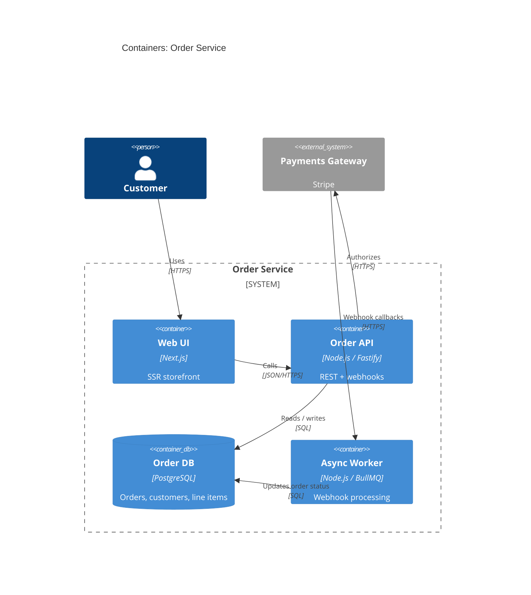
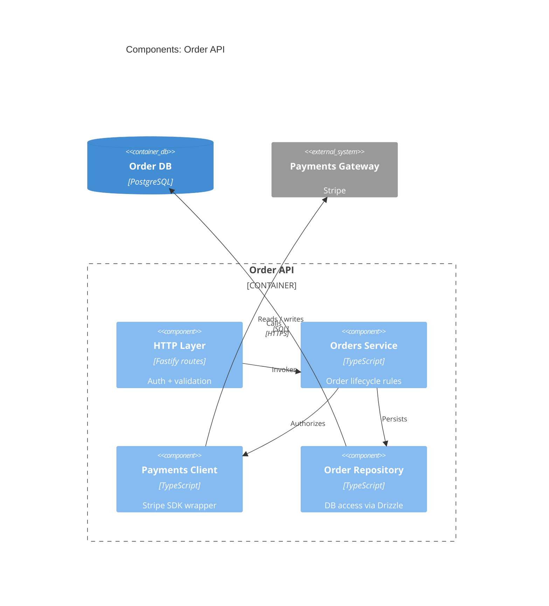
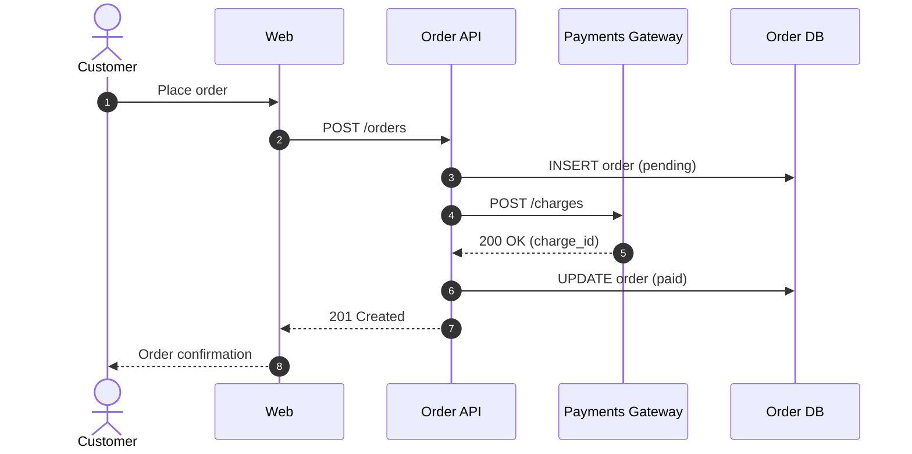
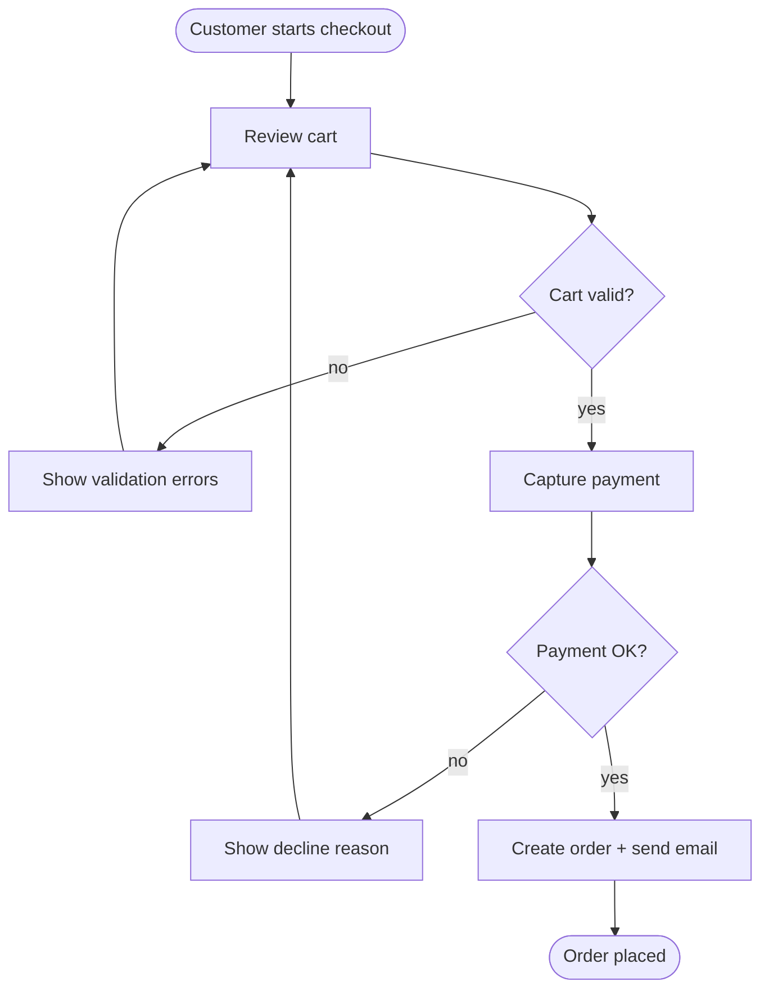
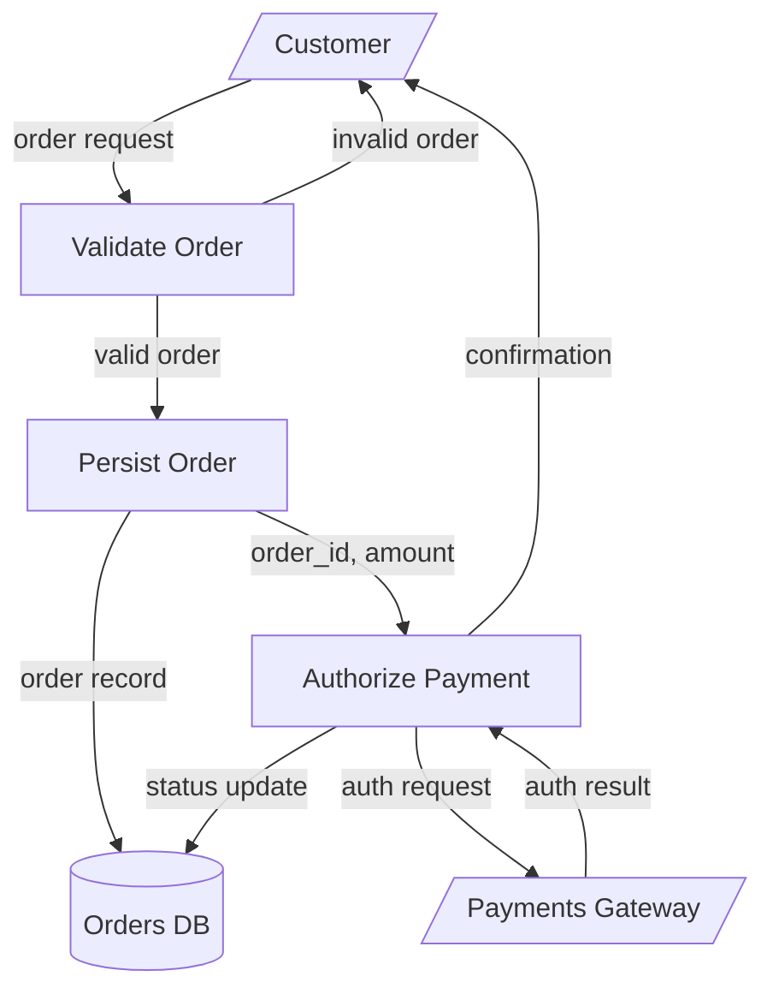

---
# Functional fields
description: Always-on architecture documentation convention for KCC v0.4. Defines the required Mermaid C4 + flowchart + DFD artifacts per architecture depth, the file locations, and the templates the architect agent uses to emit them in every scenario including `auto --silent --assume`.
inputs: Architecture depth declaration on the source idea (`lite` | `standard` | `deep`), technical / UX / security / infrastructure decision briefs, and the architect agent's run.
outputs: Mermaid C4 diagrams, flowcharts, DFDs, fitness functions, technical budgets, NFRs, ADRs, guardrails, quality gates under `architecture/`, and spec-local `arch.md` under each impacted spec folder.

# Obsidian metadata
title: "Architecture Documentation Protocol"
aliases:
  - architecture-documentation
  - always-on-architecture
  - c4-protocol
  - mermaid-architecture
tags:
  - framework/protocol
  - architecture
  - documentation
  - kcc/v04
created: 2026-05-29
updated: 2026-06-05
version: 1.1.0
status: active
copyright: "KCC framework (c) 2026 Tarek Fawaz"
homepage: "https://tikasway.dev/kcc"
license: "Licensed under the terms in LICENSE"
---

# Architecture Documentation

This protocol defines the **always-on architecture documentation** layer of
KCC v0.4. Every `auto` scenario, including `--silent --assume`, must produce
the architecture artifacts mandated by the active architecture depth. The
architect agent is the sole owner of these artifacts; the planner reads
them; the verifier enforces the fitness functions, NFRs, quality gates,
and budgets they declare.

## The core principle: SHOW the design, never link-only

Every architecture markdown - the global `architecture/architecture.md` AND
each spec's `arch.md` - must **SHOW the design inline**: embedded fenced
```mermaid``` blocks plus explanatory narrative prose. **Never** a thin
link-hub. **Never** a sub-1KB stub that just points at diagram files.

- `architecture/architecture.md` IS the **Architecture Document** (a readable
  design document), not a MOC / link hub.
- **There is no `architecture/README.md`.** The Architecture Document is
  `architecture.md`; a `README.md` hub that just lists files is forbidden (it
  was the blog-pilot drift). The mechanical conformance gate flags it.
- Each spec's `arch.md` IS a real **per-spec design document** that embeds the
  spec's slice of the design inline, not a link stub.

These rules make this concrete and are enforced by the verifier and by the
mechanical `check-run-conformance` gate (no README hub, no `.mmd`, embedded
diagrams):

- **Embed rule.** Every diagram referenced in a document appears as an inline
  fenced ```mermaid``` block with a `Source: [[file]]` citation line directly
  under it. Never put a bare link where the diagram should be. (The inline
  fenced copy renders on GitHub too, not only in Obsidian. The named diagram
  source file is the single source of truth; when a diagram changes, edit the
  source file and re-embed. Obsidian transclusion `![[name]]` is allowed as an
  alternative for Obsidian-only vaults, but the default is an inline fenced
  copy plus citation.)
- **Diagram storage rule.** Named diagram source files are `.md` (single source
  of truth), never `.mmd`, and live once under `architecture/` (or its
  `flowcharts/`, `dfds/`, `sequences/` subfolders). There is **no**
  `architecture/diagrams/` subfolder for new work; the legacy `diagrams/`
  folder is deprecated.

This protocol pairs with [[architecture-governance]] (the ADR /
guardrails / quality-gates governance), [[spec-layout]] (where spec-local
`arch.md` lives), and [[auto-mode]] (which guarantees the architect pass
runs in every scenario via CR-2).

---

## What "always-on architecture docs" means

- **Every idea** that enters the lifecycle gets a depth tag (`lite`,
  `standard`, or `deep`) before any spec is created. The idea-interrogator
  agent captures the depth; if missing, the architect defaults to
  `standard` and records the default in `architecture/assumptions.md`.
- **Every architect run** emits the artifacts the active depth requires.
  The architect's response always ends with a `## Required artifacts`
  checklist that maps to the matrix below.
- **Every impacted spec** receives a spec-local `arch.md` inside
  `specs/IDEA-{ID}-{slug}-Specs/SPEC-{ID}-{slug}/arch.md`. This is a real
  per-spec design document that embeds the spec's slice of the design inline
  (fenced mermaid + prose) plus any spec-local overrides - never a link-only
  stub.
- **Silent mode does not skip artifacts.** Under `auto --silent --assume`,
  the architect documents low-risk assumptions in each artifact's
  frontmatter and in `architecture/assumptions.md`, but every required
  artifact still ships. ADRs that relied on a silent assumption stay in
  `Status: Proposed` until the human confirms.
- **Mermaid is the only diagram dialect.** Obsidian renders Mermaid
  natively. No PlantUML, no BPMN, no draw.io binaries. See the
  [Mermaid-only convention](#mermaid-only-convention) below and the
  same-named section in [[architecture-governance]].

---

## Required artifacts matrix per depth

This matrix is the single source of truth used by the architect agent's
`## Required artifacts` checklist and by the verifier's pre-approval check.

| Artifact | `lite` | `standard` | `deep` |
|--|:------:|:----------:|:------:|
| `architecture/architecture.md` (Architecture Document - narrative + embedded diagrams) | required | required | required |
| `architecture/c4-context.md` (Mermaid `C4Context` diagram source) | required | required | required |
| `architecture/c4-container.md` (Mermaid `C4Container` diagram source) | optional | required | required |
| `architecture/c4-component.md` (Mermaid `C4Component` diagram source) | - | optional | required |
| `architecture/sequences/*.md` (Mermaid `sequenceDiagram` source) | - | optional | required (per cross-service flow) |
| `architecture/flowcharts/*.md` (Mermaid `flowchart` source - business workflow) | required (>=1) | required (>=1 per workflow) | required (>=1 per workflow) |
| `architecture/dfds/*.md` (Mermaid `flowchart TD` source - DFD conventions) | - | required when data flow is non-trivial | required (>=1 per data flow) |
| `architecture/fitness-functions.md` | required | required | required |
| `architecture/technical-budgets.md` | required | required | required |
| `architecture/nfrs.md` | required | required | required |
| `architecture/guardrails.md` | required (when any ADR exists) | required | required |
| `architecture/quality-gates.md` | required (when any ADR exists) | required | required |
| `architecture/adrs/ADR-000N-{slug}.md` | per decision | per decision | per decision |
| Spec-local `specs/IDEA-{ID}-{slug}-Specs/SPEC-{ID}-{slug}/arch.md` (embeds diagrams inline - not links) | required | required | required |
| `architecture/assumptions.md` | required when `auto --silent --assume` | required when `auto --silent --assume` | required when `auto --silent --assume` |

The named diagram source files (`c4-context.md`, `c4-container.md`,
`c4-component.md`, `flowcharts/*.md`, `dfds/*.md`, `sequences/*.md`) remain the
single source of truth for each diagram. `architecture/architecture.md` embeds
an inline fenced copy of each with a `Source: [[file]]` citation.

The same matrix is duplicated in [[architecture-governance]] so the
governance protocol stays self-contained. If they diverge, this protocol
is authoritative for the artifact list; the governance protocol is
authoritative for ADRs, guardrails, and quality gates.

---

## Mermaid-only convention

Mermaid is the only diagram dialect. Rationale:

- Obsidian renders Mermaid natively - every diagram works in the vault
  without external tooling.
- One dialect for context, container, component, sequence, flowchart, and
  DFD coverage.
- Mermaid round-trips through agents cleanly; PlantUML and binary formats
  do not.
- Per the user's documentation decision, business workflows use Mermaid
  `flowchart` blocks - **NO BPMN**. DFDs use Mermaid `flowchart TD` with
  shape conventions (rectangles = processes, cylinders = stores,
  parallelograms = external entities). No separate DFD dialect.

---

## The Architecture Document (`architecture/architecture.md`)

`architecture/architecture.md` is **the Architecture Document** - a readable
narrative design document that shows the design inline, not a MOC. The
architect authors and refreshes it. It has these required narrative sections
(depth-aware - bracketed depth tags say when a section is mandatory):

1. **Overview / purpose / scope** - what the system is, why it exists, the
   boundary of this document.
2. **Context** - the embedded C4 Context diagram + prose describing actors,
   external systems, and the system boundary.
3. **Containers** [standard+] - the embedded C4 Container diagram + prose on
   each container's responsibility and how containers interact.
4. **Components** [deep] - the embedded C4 Component diagram(s) + prose.
5. **Key workflows** - embedded flowchart(s) + prose describing the main
   business workflows.
6. **Data flows** [standard+ when non-trivial] - embedded DFD(s) + prose.
7. **Key decisions** - ADR summaries with rationale, each linking to the full
   ADR under `architecture/adrs/`.
8. **Quality attributes** - NFRs, fitness functions, and technical budgets
   summarized in narrative, each linking to the detail file
   (`nfrs.md`, `fitness-functions.md`, `technical-budgets.md`).
9. **Risks & assumptions** - known risks and (in silent mode) the assumptions
   that gated decisions, linking to `architecture/assumptions.md`.
10. **Reference artifacts** - links to the granular files: ADRs, guardrails,
    quality-gates, fitness-functions, nfrs, technical-budgets, and the named
    diagram source files.

Every diagram in sections 2-6 follows the **embed rule**: an inline fenced
```mermaid``` block with a `Source: [[file]]` citation directly under it. The
named diagram source file remains the single source of truth; the document
embeds an up-to-date copy.

The skeleton lives at [[.KCC/kernel/templates/architecture-document|architecture-document.md]].

---

## The spec-local `arch.md` (per-spec design document)

Each impacted spec's `arch.md` is a **real per-spec design document**, not a
link stub. It must EMBED inline (fenced mermaid + prose), not link, and
contains:

- **What this spec changes architecturally** - narrative of the architectural
  delta this spec introduces.
- **Context / container slice** - the relevant context/container view embedded
  inline (copy the relevant global diagram or author a spec-focused one).
- **Workflow flowchart** - the workflow for what this spec changes, embedded
  inline.
- **Data flow** - any spec-specific data flow, embedded inline when relevant.
- **Inherited governance + overrides** - the ADRs, fitness functions, technical
  budgets, and NFRs this spec inherits, plus any spec-specific overrides.
- **Open architecture questions** for the spec.

**Content bar (enforced).** Every spec `arch.md` MUST contain at least one
embedded ```mermaid``` block plus the narrative sections above. A link-only
file, or a stub under ~1 KB, **FAILS** verification. Spec-specific diagrams may
be authored inline directly in `arch.md` (no separate file is needed unless the
diagram is reused elsewhere).

The skeleton lives at [[.KCC/kernel/templates/spec-arch|spec-arch.md]];
spec-writer copies it as the stub at spec-folder creation and the architect
fills it.

---

## Mermaid C4 syntax - worked examples

The Mermaid C4 family is supported by Obsidian's bundled Mermaid renderer.

### Context (`C4Context`)

```mermaid
C4Context
    title System Context: Order Service

    Person(customer, "Customer", "Places orders via the web app")
    System(order_app, "Order Service", "Accepts and tracks customer orders")
    System_Ext(payments, "Payments Gateway", "Third-party payment provider")
    System_Ext(email, "Email Provider", "Transactional email")

    Rel(customer, order_app, "Browses, places, tracks orders")
    Rel(order_app, payments, "Authorizes payments", "HTTPS")
    Rel(order_app, email, "Sends order confirmations", "SMTP API")
```

### Container (`C4Container`)



### Component (`C4Component`)



### Sequence (`sequenceDiagram`)



---

## Flowchart template for business workflows

Mermaid `flowchart` substitutes for BPMN. Use `flowchart TD` for top-down
workflows and `flowchart LR` for left-to-right pipelines.



Conventions:

- `([rounded])` for start / end events.
- `[rectangle]` for tasks / activities.
- `{diamond}` for decisions / gateways.
- `[[subroutine]]` for invocations of named sub-workflows.
- Label edges with the decision answer (`yes` / `no`) or the trigger.

---

## DFD template

DFDs use Mermaid `flowchart TD` (or `LR`) with shape conventions that
mirror Yourdon / Gane-Sarson style:

- Rectangles `[Process]` - processes.
- Cylinders `[(Data store)]` - data stores.
- Parallelograms - external entities (use `[/External/]` or
  `[\External\]` for trapezoids, which Mermaid renders as parallelograms).
- Arrows are data flows, labeled with the data they carry.



Conventions:

- One DFD per non-trivial data flow.
- Every arrow carries a label describing the data.
- Trust boundaries are drawn with subgraph blocks; cross-boundary edges
  must be explicitly labeled with the boundary they cross.

---

## Where artifacts live

### Global (under `architecture/`)

```text
architecture/
|-- architecture.md             <- the Architecture Document (narrative + embedded diagrams; NOT a MOC)
|-- c4-context.md               <- Mermaid C4Context source (always required)
|-- c4-container.md             <- Mermaid C4Container source (standard+ required)
|-- c4-component.md             <- Mermaid C4Component source (deep required)
|-- sequences/
|   `-- {interaction}.md        <- Mermaid sequenceDiagram source (deep)
|-- flowcharts/
|   `-- {workflow}.md           <- Mermaid flowchart source (business workflows)
|-- dfds/
|   `-- {flow}.md               <- Mermaid flowchart TD source with DFD conventions
|-- fitness-functions.md        <- evolutionary-architecture style checks
|-- technical-budgets.md        <- latency / memory / error / cost ceilings
|-- nfrs.md                     <- availability, scalability, security, observability, accessibility, operability
|-- guardrails.md               <- active design constraints
|-- quality-gates.md            <- objective verifier-readable gates
|-- assumptions.md              <- silent-mode assumption log (created when needed)
`-- adrs/
    |-- adrs.md                 <- ADR index
    `-- ADR-000N-{slug}.md      <- per decision
```

> **Deprecated:** the legacy `architecture/diagrams/` folder and any raw
> `.mmd` files (v0.3) are deprecated. New work uses the named `.md` diagram
> source files above - one fenced ```mermaid``` block per file - and embeds
> them inline in `architecture.md`. Do not create `diagrams/` or `.mmd` files
> for new work.

### Spec-local

```text
specs/IDEA-{ID}-{slug}-Specs/
`-- SPEC-{ID}-{slug}/
    `-- arch.md                 <- ALWAYS required (every depth)
```

The spec-local `arch.md` is a real per-spec design document (see
[the spec-local `arch.md` section](#the-spec-local-archmd-per-spec-design-document)
above for the full spec and content bar). In summary it:

- Narrates what the spec changes architecturally.
- EMBEDS inline (not links): the spec's context/container slice, the workflow
  flowchart for what the spec changes, and any spec-specific data flow.
- States inherited ADRs / fitness functions / technical budgets / NFRs plus any
  spec-specific overrides.
- Tracks open architecture questions for the spec.
- Must contain at least one embedded ```mermaid``` block - a link-only or
  sub-1 KB stub fails verification.

---

## Templates

The architect copies these templates as a starting point:

- [[.KCC/kernel/templates/architecture-document|architecture-document.md]] - the Architecture Document skeleton for `architecture/architecture.md`.
- [[.KCC/kernel/templates/spec-arch|spec-arch.md]] - the per-spec `arch.md` skeleton (spec-writer copies as the stub; architect fills).
- [[.KCC/kernel/templates/c4-context|c4-context.md]]
- [[.KCC/kernel/templates/c4-container|c4-container.md]]
- [[.KCC/kernel/templates/flowchart-business|flowchart-business.md]]
- [[.KCC/kernel/templates/dfd|dfd.md]]

Each template has Obsidian frontmatter ready to paste and worked-example
Mermaid blocks that compile in Obsidian and on GitHub out of the box.

---

## Update cadence

The architect runs:

1. **At idea introduction** - produces the first cut of every required
   artifact based on the technical / UX / security / infrastructure
   decision briefs.
2. **At every major spec** - refreshes any artifact affected by the spec
   and produces (or updates) the spec-local `arch.md`. "Major" means the
   spec introduces a new component, a new external integration, a new
   data flow, a new NFR, a budget change, or a security-relevant
   decision.
3. **On any ADR change** - refreshes the ADR file, the ADR index, and any
   diagram that depends on the decision.
4. **In silent mode** - same cadence; assumptions land in
   `architecture/assumptions.md` instead of human gates.

The verifier enforces "no spec ships without an `arch.md` that contains at
least one embedded ```mermaid``` block and the required design sections" (a
link-only / sub-1 KB stub is CHANGES_NEEDED), "the global
`architecture/architecture.md` exists as the Architecture Document with its
sections", and "no quality gate / fitness function is violated by the
implementation".

---

## Related

- Architecture governance: [[architecture-governance]]
- Spec layout: [[spec-layout]]
- Idea layout: [[idea-layout]]
- Auto mode: [[auto-mode]]
- Progress tracking: [[progress-tracking]]
- Obsidian standard: [[obsidian-standard]]
- Architect agent: [[.KCC/capabilities/agents/architect]]
- Planner agent: [[.KCC/capabilities/agents/planner]]
- Template - Architecture Document: [[.KCC/kernel/templates/architecture-document]]
- Template - Spec arch.md: [[.KCC/kernel/templates/spec-arch]]
- Template - C4 Context: [[.KCC/kernel/templates/c4-context]]
- Template - C4 Container: [[.KCC/kernel/templates/c4-container]]
- Template - Business flowchart: [[.KCC/kernel/templates/flowchart-business]]
- Template - DFD: [[.KCC/kernel/templates/dfd]]
