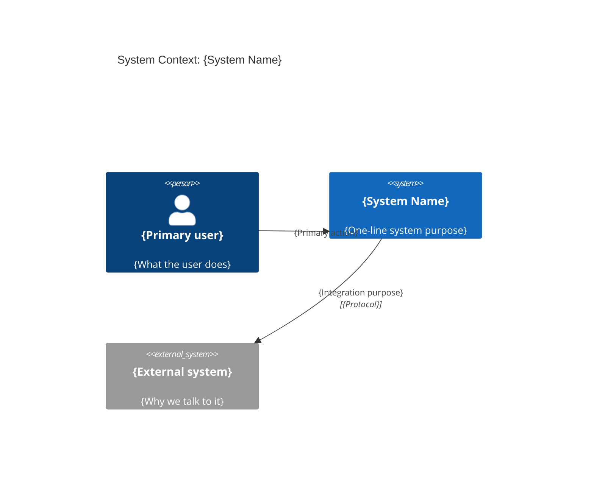
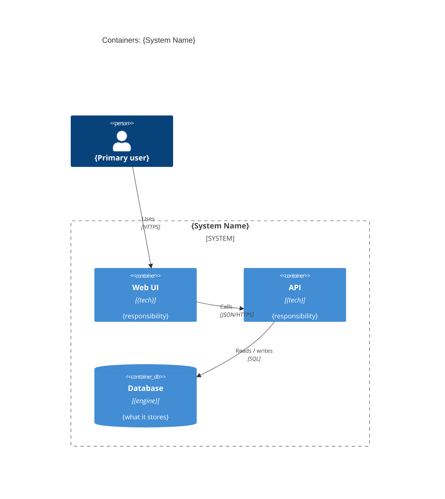
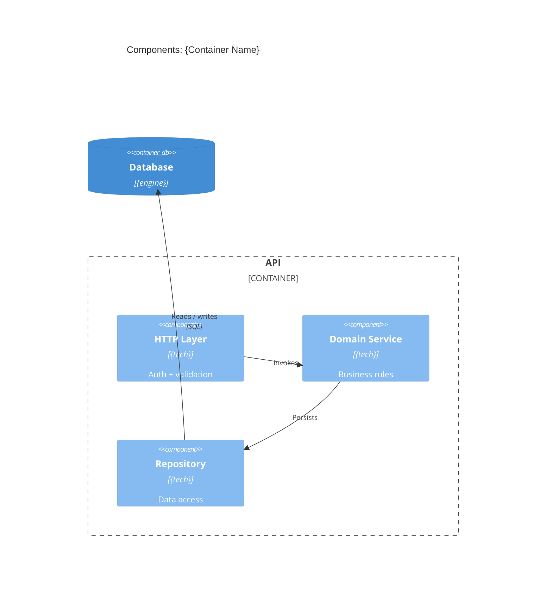

# Architecture Document - {System Name}

> Copy this file to `architecture/architecture.md` and replace every
> placeholder. This file IS the Architecture Document - a readable design
> document that SHOWS the design inline. It is **not** a MOC / link hub.
>
> **Embed rule:** every diagram below is an inline fenced ```mermaid``` block
> with a `Source: [[file]]` citation directly under it. The named diagram
> source file (e.g. `c4-context.md`) is the single source of truth; when a
> diagram changes, edit the source file and re-embed the up-to-date copy here.
> (`![[name]]` transclusion is allowed in Obsidian-only vaults, but the
> default is an inline fenced copy + citation so it renders on GitHub too.)
>
> Sections are depth-aware: bracketed tags say when a section is mandatory.
> Delete sections that do not apply at your depth, but keep 1, 2, 5, 7, 8, 9,
> 10 at every depth.

## 1. Overview / purpose / scope

{What the system is, why it exists, and the boundary of this document. One or
two paragraphs. Name the primary outcome and the audience for this document.}

## 2. Context

{Prose: who the actors are, which external systems the system integrates with,
and where the system boundary sits.}



Source: [[c4-context]]

## 3. Containers [standard+]

{Prose: each container's responsibility and how containers interact. One short
paragraph per container.}



Source: [[c4-container]]

## 4. Components [deep]

{Prose: the internal components of the container(s) that warrant detail and how
they collaborate.}



Source: [[c4-component]]

## 5. Key workflows

{Prose: the main business workflow(s). One flowchart per non-trivial
workflow, each with a paragraph of explanation.}

```mermaid
flowchart TD
    Start([{Trigger}]) --> Step1[{First step}]
    Step1 --> Decision{{Condition?}}
    Decision -- yes --> Step2[{Happy path}]
    Decision -- no --> Step3[{Alternate path}]
    Step2 --> End([{Outcome}])
    Step3 --> End
```

Source: [[flowcharts/{workflow-name}]]

## 6. Data flows [standard+ when non-trivial]

{Prose: how data moves between processes, stores, and external entities.}

```mermaid
flowchart TD
    ext[/{External entity}/] -- "{data}" --> p1[{Process}]
    p1 -- "{data}" --> store[({Data store})]
    p1 -- "{data}" --> p2[{Process}]
    p2 -- "{data}" --> ext
```

Source: [[dfds/{flow-name}]]

## 7. Key decisions

{Summarize each durable architecture decision with its rationale, and link the
full ADR. Keep summaries to two or three sentences.}

| ADR | Decision | Rationale (summary) | Status |
|--|--|--|--|
| [[adrs/ADR-0001-{slug}\|ADR-0001]] | {decision} | {why} | Accepted |

## 8. Quality attributes

{Summarize the NFRs, fitness functions, and technical budgets in narrative,
linking each detail file.}

- **NFRs:** {availability, scalability, security, observability, accessibility,
  operability targets - summary}. Detail: [[nfrs]].
- **Fitness functions:** {key automatable checks - summary}. Detail:
  [[fitness-functions]].
- **Technical budgets:** {latency / memory / error rate / cost ceilings -
  summary}. Detail: [[technical-budgets]].

## 9. Risks & assumptions

{Known architectural risks and their mitigations. In silent mode, list the
assumptions that gated decisions and link the assumptions log.}

- {Risk} - {mitigation}.
- {Assumption (silent runs)} - see [[assumptions]].

## 10. Reference artifacts

- ADR index: [[adrs/adrs]]
- Guardrails: [[guardrails]]
- Quality gates: [[quality-gates]]
- Fitness functions: [[fitness-functions]]
- NFRs: [[nfrs]]
- Technical budgets: [[technical-budgets]]
- Diagram sources: [[c4-context]], [[c4-container]], [[c4-component]],
  `flowcharts/`, `dfds/`, `sequences/`
- Assumptions log (silent runs): [[assumptions]]

## Related

- Architecture documentation protocol: [[../protocols/architecture-documentation]]
- Architecture governance protocol: [[../protocols/architecture-governance]]
- Architect agent: [[../../capabilities/agents/architect]]
