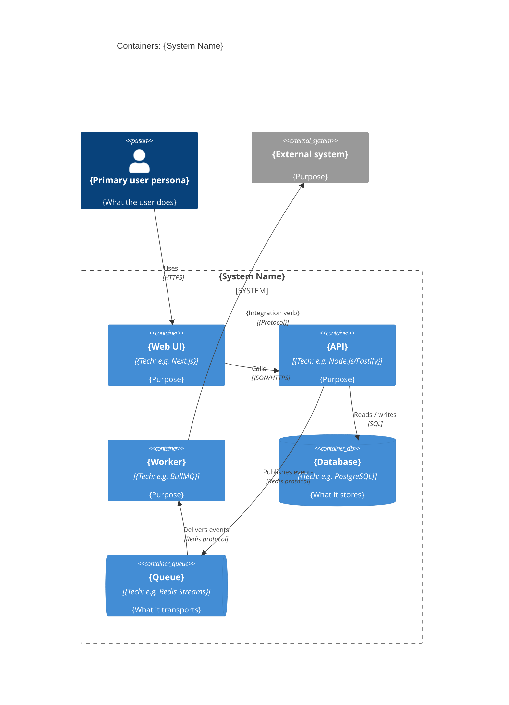

# C4 Container - {System Name}

> Copy this file to `architecture/c4-container.md` and replace every
> placeholder. The Container diagram zooms in on the system from the
> Context diagram and shows the apps, services, data stores, and runtime
> processes that make it up, plus how they communicate.

## Diagram

## Filling instructions

1. **System boundary.** Wrap every container the team owns in a single
   `System_Boundary()` named after the system.
2. **Containers.** One block per deployable / runtime process. Pick the
   right helper:
   - `Container()` - generic app or service.
   - `ContainerDb()` - database / persistent store.
   - `ContainerQueue()` - queue / stream / message broker.
3. **Tech.** Include the concrete tech in the second argument so readers
   know what they're committing to (e.g. `Node.js/Fastify`,
   `PostgreSQL 16`, `Redis Streams`).
4. **External systems.** Reuse the `System_Ext()` names from the Context
   diagram so the two diagrams stay aligned.
5. **Relationships.** Always label with verb + protocol. If a relationship
   needs constraints, add them in `## Notes` below.
6. **Depth gating.**
   - `lite`: this diagram is optional; if you skip it, document why in
     the spec-local `arch.md`.
   - `standard` / `deep`: this diagram is required.
7. **Assumptions block** (silent-mode only). When the architect runs
   under `auto --silent --assume`, fill the section below and set the
   frontmatter `silent-assumption: true`.

## Notes

- {Cross-cutting constraint, e.g. "All API -> DB traffic stays in-VPC"}

## Assumptions (silent runs only)

- {Assumption ID from `architecture/assumptions.md`} - {one-line summary}

## Related

- Architecture MOC: [[../../architecture/architecture]]
- Context diagram: [[../../architecture/c4-context]]
- Component diagram (deep): [[../../architecture/c4-component]]
- Architecture documentation protocol: [[../protocols/architecture-documentation]]
- Architecture governance protocol: [[../protocols/architecture-governance]]
