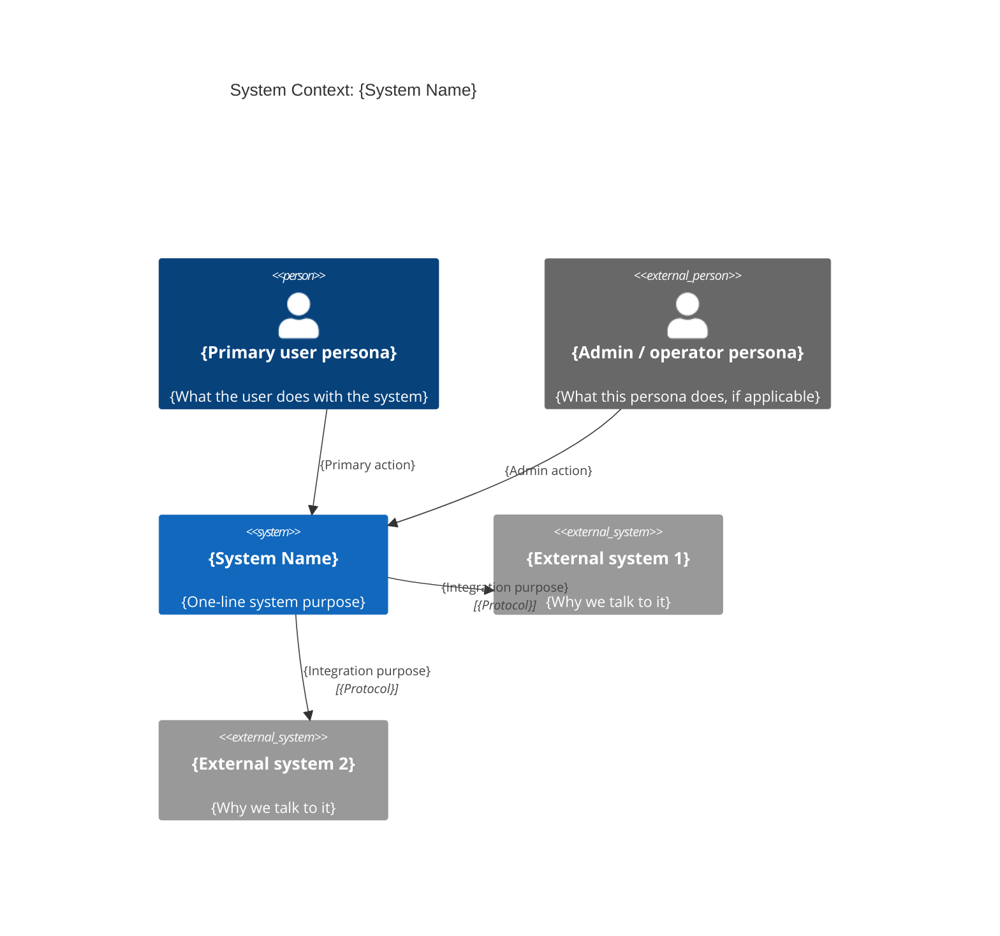

# C4 Context - {System Name}

> Copy this file to `architecture/c4-context.md` and replace every
> placeholder. The Context diagram shows the system in its environment:
> who uses it, what other systems it talks to, and the high-level
> purpose. Keep it to a single page.

## Diagram

## Filling instructions

1. **Title.** Use the system name as it appears in the idea / spec.
2. **Personas.** Use `Person()` for human users you control and
   `Person_Ext()` for external personas (regulators, third-party
   operators). At minimum: the primary user. Add personas only when they
   change the behavior of the system.
3. **System.** Exactly one `System()` block - the system this repo /
   workspace owns.
4. **External systems.** Use `System_Ext()` for every other system the
   primary system depends on or that depends on it. Include the
   integration protocol when it constrains the design (HTTPS, SMTP, gRPC,
   message bus, file share, etc.).
5. **Relationships.** Every `Rel()` is directional. Include the verb
   ("Authorizes", "Sends events to", "Reads from") and, for external
   systems, the protocol.
6. **Assumptions block** (silent-mode only). When the architect runs
   under `auto --silent --assume`, fill the section below and set the
   frontmatter `silent-assumption: true`.

## Assumptions (silent runs only)

- {Assumption ID from `architecture/assumptions.md`} - {one-line summary}

## Related

- Architecture MOC: [[../../architecture/architecture]]
- Container diagram: [[../../architecture/c4-container]]
- Architecture documentation protocol: [[../protocols/architecture-documentation]]
- Architecture governance protocol: [[../protocols/architecture-governance]]
