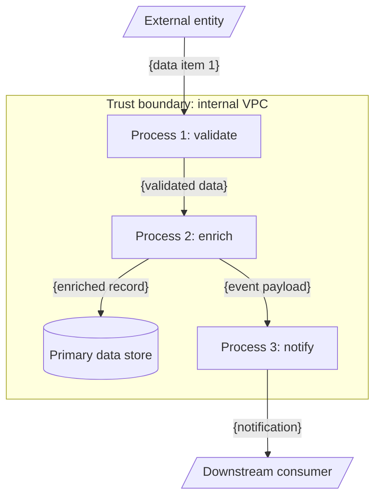

# Data Flow Diagram - {Data Flow Name}

> Copy this file to `architecture/dfds/{flow-slug}.md` and replace every
> placeholder. DFDs use Mermaid `flowchart TD` with shape conventions
> that mirror Yourdon / Gane-Sarson style. One DFD per non-trivial data
> flow.

## Scope

{What data does this flow describe? Where does it start, where does it
end, and which trust boundaries does it cross?}

## Diagram

## Filling instructions

1. **Shapes.**
   - `[Process]` - a process / transformation. Number them (`p1`, `p2`,
     ...) and use a verb in the label ("validate", "enrich", "notify").
   - `[(Data store)]` - a persistent store. Label with the store's
     business name, not its tech.
   - `[/External entity/]` - an external entity (user, third-party
     system, partner). Mermaid renders these as parallelograms via the
     `[/.../]` shape.
2. **Arrows.** Every arrow carries a label describing the **data**, not
   the trigger. "order request" - yes. "user clicks Buy" - no, that goes
   in the business flowchart.
3. **Trust boundaries.** Draw each trust boundary as a `subgraph` block
   and put the processes / stores it contains inside. Cross-boundary
   edges must be explicitly labeled with what crosses (data item + any
   transformation that happens at the boundary, e.g. encryption,
   redaction).
4. **Data sensitivity.** Set `data-sensitivity` in frontmatter using the
   project's taxonomy. If multiple classes flow through the same DFD,
   list the highest and note exceptions in `## Sensitivity notes`.
5. **Granularity.** One DFD per data flow that matters. If you find
   yourself adding "and also..." processes, split into a second DFD.
6. **Assumptions block** (silent-mode only). When the architect runs
   under `auto --silent --assume`, fill the section below and set the
   frontmatter `silent-assumption: true`.

## Sensitivity notes

- {Data class} - {how it's handled across the trust boundary it crosses}

## Retention / deletion

- {Data store} - {retention window, deletion trigger}

## Assumptions (silent runs only)

- {Assumption ID from `architecture/assumptions.md`} - {one-line summary}

## Related

- Architecture MOC: [[../../architecture/architecture]]
- Container diagram: [[../../architecture/c4-container]]
- Business workflow (if relevant): [[../../architecture/flowcharts/{workflow-slug}]]
- Architecture documentation protocol: [[../protocols/architecture-documentation]]
- Architecture governance protocol: [[../protocols/architecture-governance]]
