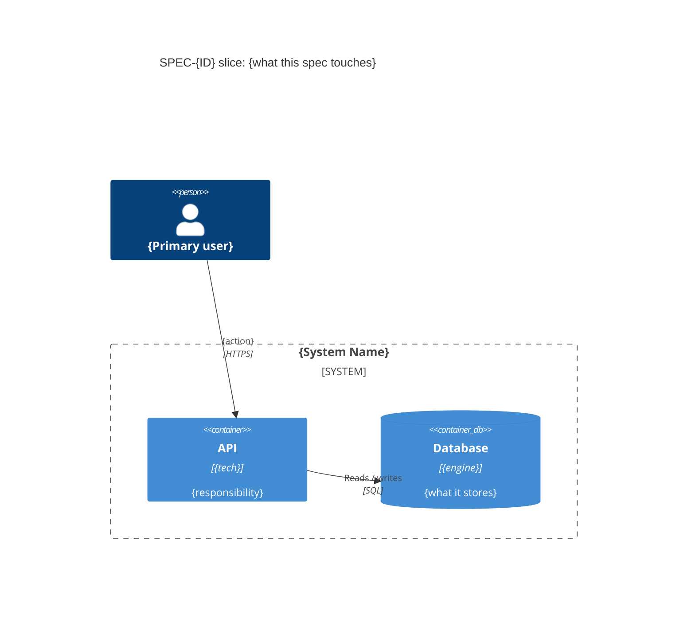

# SPEC-{ID} Architecture

> awaiting architect

> This is a real **per-spec design document**, not a link stub. The
> spec-writer seeds the section skeleton (headings only); the architect fills it.
> It must SHOW the spec's slice of the design inline (fenced ```mermaid``` +
> prose), never link-only.
>
> **Content bar (enforced by the verifier):** this file MUST end up with at
> least one embedded ```mermaid``` block plus the design narrative below. A
> link-only file or a sub-1 KB stub FAILS verification. Spec-specific diagrams
> may be authored inline directly here (no separate file unless reused).

## What this spec changes architecturally

{Narrative of the architectural delta this spec introduces - new components,
new integrations, new data flows, changed contracts, or changed boundaries.}

## Context / container slice

{Embed the relevant context/container view inline - copy the relevant global
diagram or author a spec-focused one. Cite the global source when you copied
one.}



Source: [[../../../architecture/c4-container]] (or authored inline for this spec)

## Workflow this spec changes

{Embed the flowchart for the workflow this spec adds or changes, plus a
paragraph of explanation.}

```mermaid
flowchart TD
    Start([{Trigger}]) --> Step1[{New / changed step}]
    Step1 --> Decision{{Condition?}}
    Decision -- yes --> Step2[{Result}]
    Decision -- no --> Step3[{Alternate}]
    Step2 --> End([{Outcome}])
    Step3 --> End
```

## Data flow (if relevant)

{Embed any spec-specific data flow inline; delete this section if the spec
introduces none.}

```mermaid
flowchart TD
    ext[/{External entity}/] -- "{data}" --> p1[{Process}]
    p1 -- "{data}" --> store[({Data store})]
```

## Inherited governance + overrides

- **ADRs inherited:** {[[../../../architecture/adrs/ADR-0001-{slug}|ADR-0001]],
  ...} - any spec-specific override: {none | description}.
- **Fitness functions:** {which apply} - overrides: {none | description}.
- **Technical budgets:** {which apply} - overrides: {none | description}.
- **NFRs:** {which apply} - overrides: {none | description}.

## Open architecture questions

- {Question for the human or for a later ADR, or "None."}

## Related

- Epic spec: [[SPEC-{ID}-{slug}]]
- Architecture Document: [[../../../architecture/architecture]]
- Architecture documentation protocol: [[../../../.KCC/kernel/protocols/architecture-documentation]]
- Idea-specs index: [[../IDEA-{ID}-{slug}-Specs]]
