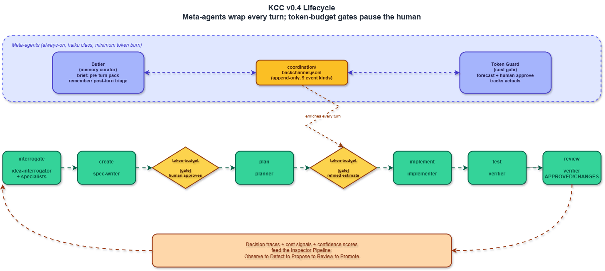

# KCC: Agentic AI Operating Model and Spec-Driven Workflow Framework

KCC is a local-first **agentic AI operating model** and
**spec-driven workflow framework** for teams using AI coding agents such as
Codex, Claude Code, OpenCode, and Ollama-backed runners.

[](./PLAN.md)
[](./LICENSE)
[](#initialize-or-sync)

It asks a practical question:

> How can teams use autonomous agents without losing governance, traceability,
> cost awareness, security posture, and reusable learning?

This repository is a working reference implementation of **one local KCC
cell**. It does not implement every part of the wider KCC operating model.
Instead, it shows how one team can turn the doctrine into a usable workflow:
ideas become specs, specs become plans, plans become code, and every step
leaves decisions, traces, cost signals, and reusable knowledge behind.

> KCC exists to structurally compound intelligence without collapsing
> governance.

## Why KCC Exists

Scaling agentic AI inside an organization tends to produce four structural
failures. KCC is designed around preventing each one:

| Failure | What it looks like | KCC's structural answer |
|---|---|---|
| **Fragmentation** | Every team builds its own incompatible agents, prompts, and conventions; nothing composes. | A shared **kernel** of contracts every cell honors, with capabilities promoted across teams. |
| **Invisible cost** | Token and time spend is unmeasured until the bill or the deadline arrives. | A **cost envelope** surface and the **Token Guard** meta-agent that estimates and gates spend before work runs. |
| **Untraceable decisions** | You cannot reconstruct why an agent did what it did. | A first-class **decision trace** surface and append-only backchannel + per-run trace sessions. |
| **Trapped knowledge** | What one agent learns dies in its context window. | The **Butler** meta-agent curates reusable memory; good local patterns are promoted into shared capabilities. |

The load-bearing claim: *the kernel does not run the cells - it defines the
contract they all honor.*

## Who This Is For

This repo is for:

| Audience | What you get |
|---|---|
| Engineering leaders | A concrete model for governing agentic work across teams. |
| Platform teams | A reusable kernel/capability/cell structure for agent workflows. |
| Delivery teams | A local framework for moving from idea to implementation with human gates. |
| Contributors | A starting point for improving agents, skills, protocols, tools, and docs. |

If you only want to run the framework, start with [QUICKSTART.md](./QUICKSTART.md).
If you want to understand the operating-model claim, start here.

## Quick Start

```powershell
git clone https://github.com/TarekFawaz/kcc-agentic-framework.git my-project
cd my-project
powershell -ExecutionPolicy Bypass -File .KCC\tools\framework-init.ps1 codex
powershell -ExecutionPolicy Bypass -File .KCC\tools\validate-kcc.ps1
```

Then open your preferred harness and start with an idea:

```text
auto build a CLI that converts CSV to JSON
```

See [QUICKSTART.md](./QUICKSTART.md) for Claude Code, Codex CLI, OpenCode,
and Mac/Linux paths.

## GitHub Topics

Suggested repository topics:

```text
agentic-ai ai-agents ai-governance spec-driven-development
software-engineering developer-tools workflow-automation llmops
codex claude-code opencode ollama multi-agent-systems
human-in-the-loop
```

## Why Not Just Use Coding Agents Directly?

Individual agents can be fast. The hard organizational problem is making that
speed accountable, repeatable, and learnable. KCC adds the missing operating
surfaces around agentic work: specs, decision traces, confidence gates, token
budgets, specialist interrogators, test/review handoffs, and reusable memory.

## How KCC Differs

| Compared with | KCC's emphasis |
|---|---|
| Prompt libraries | Kernel contracts, traceability, and lifecycle gates instead of loose prompt reuse. |
| Single-agent coding assistants | Multi-agent role separation across idea, architecture, planning, implementation, verification, and memory. |
| Generic agent frameworks | Software-delivery governance: specs, backlogs, token budgets, confidence, and review artifacts. |
| Project templates | A reproducible local cell that generates harness-specific surfaces from one `.KCC` source of truth. |

## The KCC Idea

Most AI adoption starts as individual productivity: better prompting, faster
coding, local automations, and personal workflows. That helps, but it does
not automatically create organizational learning.

KCC proposes a federated structure:

> One kernel. Many capabilities. Many cells.

| Layer | Purpose | Owner | Change pace |
|---|---|---|---|
| Kernel | Shared contracts, governance rules, schemas, confidence gates, cost envelopes, decision traces, maturity rules. | Kernel maintainers | Slow |
| Capabilities | Reusable agents, skills, hooks, evaluations, and patterns that conform to the kernel. | Capability maintainers | Medium |
| Cells | Team-owned compositions of kernel + selected capabilities + local additions. This is where work ships. | Delivery teams | Fast |

The kernel does not run the teams. It defines the rules of the road. Cells
stay local and autonomous, but they emit evidence: traces, decisions, costs,
confidence signals, failures, and patterns. Over time, good local patterns
can be promoted into reusable capabilities.

## The Agent Contract: Nine Surfaces

Every KCC capability honors a kernel-defined agent contract. Seven surfaces are
operational; the last two are the distinctive KCC contribution - **cognitive**
surfaces that few agent frameworks treat as first-class, kernel-enforced fields.

| # | Surface | Kind | What it declares |
|---|---|---|---|
| 1 | Identity | Operational | Who the agent is and what role it fills. |
| 2 | Input schema | Operational | What it accepts. |
| 3 | Output schema | Operational | What it returns. |
| 4 | Declared tools | Operational | Which tools it may use. |
| 5 | Cost envelope | Operational | Its token/blast-radius budget. |
| 6 | HITL / HOTL | Operational | When a human must be in or on the loop. |
| 7 | Observability | Operational | What evidence it must emit. |
| 8 | **Confidence** | Cognitive | A computed confidence score per turn, gated against a threshold. |
| 9 | **Decision trace** | Cognitive | A replayable record of why it decided what it did. |

Two **meta-agents** enforce the contract across every turn: **Token Guard**
(cost envelope, surface 5) and **Butler** (memory, calibration, and trace
custody). Both run at the cheapest model class to keep overhead low.

## What This Repo Is

This repository is one example cell with the kernel and capabilities included
locally:

| Area | Role |
|---|---|
| `.KCC/kernel/` | Source of truth for contracts, protocols, adapters, templates, dialects, and governance docs. |
| `.KCC/capabilities/` | Source of truth for local reusable agents and skills. |
| `.KCC/tools/` | Init, sync, validation, migration, backchannel, and session tools. |
| Root docs | Public explanation, quick start, contribution docs, and roadmap. |

Generated harness folders such as `.claude/`, `.codex/`, `.opencode/`,
`.agents/`, and `ollama/` are **local output**, not source. They are adapter
surfaces generated from `.KCC/` when the user initializes or syncs the
framework.

## Current Status

| Surface | Current state |
|---|---|
| Source agents | 17 |
| Source skills | 22 |
| Dialects | 23 |
| Harness adapter targets | Claude Code, Codex CLI, OpenCode, generic `.agents`, Ollama |
| Structural validation | Passing with 0 errors and 0 warnings (PowerShell + bash, cell + repo modes) |
| Current maturity | Public alpha / field-pilot reference implementation |

The detailed implementation status lives in
[docs/alignment-matrix.md](./docs/alignment-matrix.md). The future activity
list lives in [PLAN.md](./PLAN.md).

## Lifecycle

The cell moves work through a fixed lifecycle:

```text
interrogate -> create -> estimate -> plan -> estimate -> implement -> test -> review -> deploy
```

The animated lifecycle view is here:



Editable diagram sources live in [docs/diagrams/](./docs/diagrams/).

## Operating Scenarios

The framework supports human-led and Human On The Loop modes:

| Operating scenario | Trigger | Behavior |
|---|---|---|
| Default HOTL | `auto <idea>` | Starts with human interrogation, then runs until a required gate is hit. |
| Full hand-off HOTL | `auto <idea> --silent --assume` | Agents make allowed decisions and document assumptions. Stops only on safety, confidence, loop, or prohibited-assumption gates. |
| Controlled hand-off HOTL | `auto <idea> --silent --assume --accuracy 99% --budget 200` | Full hand-off with explicit confidence and budget controls. |
| Direct HITL | `/idea-interrogator <idea>` | Human-led idea interrogation. |
| Individual skills | `/spec-create`, `/spec-plan`, etc. | Human starts at a specific lifecycle step. |

`auto` is the main HOTL entrypoint. It is not permission to skip governance.
Fresh ideas still start with interrogation unless the user explicitly chooses
full hand-off mode.

Add `--parallel` to any of these to force parallel agent sessions - spec
creation fans out one subagent per epic, and parallel windows open without the
per-spec prompt (e.g. `auto <idea> --parallel`). See
[QUICKSTART.md](./QUICKSTART.md#the-auto-skill-in-depth).

## Source Package vs Generated Output

The public source package should contain the framework source and docs:

```text
.KCC/
|-- kernel/
|-- capabilities/
|-- tools/
|-- sandbox/
`-- settings.json

README.md
QUICKSTART.md
example-solutions.md
CONTRIBUTING.md
CODE_OF_CONDUCT.md
SECURITY.md
MAINTAINERS.md
LICENSE
docs/
```

Expected local output after init/sync:

```text
AGENTS.md
CLAUDE.md
.claude/
.codex/
.opencode/
.agents/
ollama/
memory/
coordination/
architecture/
solution/
ideation/
specs/
Traces/
migrations/
src/
```

Generated output is ignored by default. If this public repo needs to show a
captured example of generated output, place it under [output/](./output/)
instead of committing live harness folders at the root.

## Repository Map

| Path | Description |
|---|---|
| `.KCC/kernel/` | KCC governance: contracts, protocols, adapters, templates, dialects, cells, inspector, phase model. |
| `.KCC/capabilities/agents/` | Neutral source files for lifecycle, specialist, meta, and utility agents. |
| `.KCC/capabilities/skills/` | Neutral source files for slash-command style skills. |
| `.KCC/tools/` | Canonical tool entrypoints for Windows PowerShell and Mac/Linux bash. |
| `.KCC/sandbox/` | Docker sandbox files and sandbox runtime docs. |
| `docs/agentic-ai-operating-model.md` | Search-friendly overview of the KCC operating-model claim. |
| `docs/spec-driven-ai-development.md` | How KCC structures AI-assisted delivery around specs and evidence. |
| `docs/ai-agent-governance.md` | Governance surfaces: cost, confidence, traces, toolchain gates, and memory. |
| `docs/kcc-vs-agent-frameworks.md` | How KCC differs from prompt libraries, coding assistants, and agent frameworks. |
| `docs/codex-claude-opencode-ollama.md` | Harness adapter overview for Codex, Claude Code, OpenCode, generic, and Ollama. |
| `docs/alignment-matrix.md` | Honest status matrix against the KCC v0.4 operating-model primitives. |
| `docs/diagrams/` | Animated GIF, Mermaid, and draw.io sources. |
| `PLAN.md` | Future work and roadmap for this local-cell reference implementation. |
| `QUICKSTART.md` | Guided first run. |

## Initialize or Sync

Windows:

```powershell
powershell -ExecutionPolicy Bypass -File .KCC\tools\framework-init.ps1 -Harness codex
powershell -ExecutionPolicy Bypass -File .KCC\tools\sync-adapters.ps1
powershell -ExecutionPolicy Bypass -File .KCC\tools\validate-kcc.ps1
```

Mac/Linux:

```bash
bash .KCC/tools/bootstrap-mac-linux.sh
bash .KCC/tools/framework-init.sh codex
bash .KCC/tools/sync-adapters.sh
bash .KCC/tools/validate-kcc.sh
```

Supported harness values:

```text
claude | codex | opencode | generic | ollama | all
```

## Important Concepts

| Concept | Meaning |
|---|---|
| Cell | A team-owned composition of kernel, selected capabilities, and local additions. This repo is one cell. |
| Adapter surface | Generated harness-specific output for a cell, such as `.codex/` or `.claude/`. |
| Capability | A reusable agent or skill that follows kernel contracts. |
| Gate | A required stop for human approval, budget, confidence, safety, or scope. |
| Trace | A session-level record of actions, tools, decisions, handovers, and token usage. |
| Butler | Meta-agent responsible for memory and calibration signals. |
| Token Guard | Meta-agent responsible for cost estimates and budget gates. |

## What Is Not Implemented Yet

This repo is intentionally honest about its gaps. The main deferred areas are:

- trace-driven Inspector automation
- full decision-trace replay tooling
- tracker adapters for Jira, Azure DevOps, Asana, Linear, and GitHub Issues
- production pipeline templates for deploy
- real Mac/Linux host validation for the native bash path
- multi-cell rollout examples across separate team repos
- native `kcc` CLI packaging

See [PLAN.md](./PLAN.md) for the full roadmap.

## Contributing

Contributions should improve either:

1. the KCC operating-model implementation,
2. the local-cell developer experience,
3. the quality of agents, skills, protocols, and dialects,
4. the validation and evidence story, or
5. the clarity of public docs.

Start with [CONTRIBUTING.md](./CONTRIBUTING.md) and
[MAINTAINERS.md](./MAINTAINERS.md).

## Project Links

- GitHub repository: https://github.com/TarekFawaz/kcc-agentic-framework
- Website: https://tikasway.dev
- KCC v0.4 public specification: https://tikasway.dev/kcc

## License

KCC framework (c) 2026 Tarek Fawaz, [tikasway.dev](https://tikasway.dev/kcc). Licensed under the terms in [LICENSE](./LICENSE).
